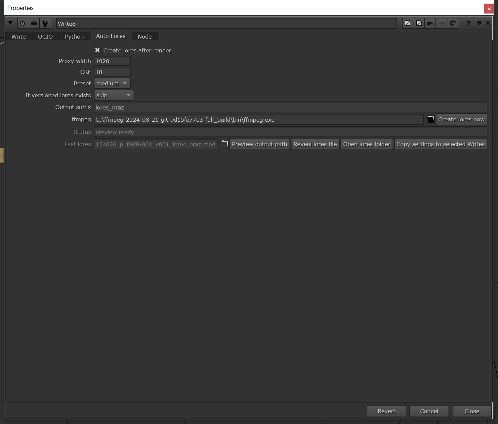

# Auto Lores Proxy for Nuke

Auto Lores Proxy is a Nuke helper for creating review-friendly MP4 lores files automatically from rendered `Write` outputs.

It is made for a common VFX folder structure:

```text
output/hires
output/lores
```

Render your hires movie from Nuke, and Auto Lores Proxy can create the matching lores MP4 after the render finishes.



## What it does

- Adds an **Auto Lores** tab to every Nuke `Write` node
- Creates H.264 MP4 lores files after a successful `Write` render
- Uses FFmpeg, so Nuke does not need to render the comp twice
- Preserves anamorphic display aspect automatically
- Converts output to square-pixel `yuv420p` MP4 for better client playback
- Detects version tokens like `v001`, `v006`, `v123`
- Sends files with `LUT` in the path or filename into `lores/LUT`
- Shows status and the last generated lores path on the `Write` node
- Can preview the output path before rendering
- Can reveal the created lores file or open the lores folder
- Can copy Auto Lores settings from one `Write` node to other selected `Write` nodes

## Example

Versioned render:

```text
D:/JOB/Project/output/hires/shot_v006.mov
```

Creates:

```text
D:/JOB/Project/output/lores/shot_v006_lores_nraz.mp4
```

Unversioned render:

```text
D:/JOB/Project/output/hires/shot.mov
```

Creates:

```text
D:/JOB/Project/output/lores/shot_lores_nraz_v001.mp4
```

LUT render:

```text
D:/JOB/Project/output/hires/LUT/shot_LUT_v006.mov
```

Creates:

```text
D:/JOB/Project/output/lores/LUT/shot_LUT_v006_lores_nraz.mp4
```

## Why

I often render hires files from Nuke and then need a clean lores MP4 for review, upload, or client delivery.

Doing that manually means:

- checking versions
- remembering if the shot is anamorphic
- making sure LUT versions go into the right folder
- avoiding broken MP4 metadata
- opening terminals or batch files after every render

This tool keeps that work attached to the `Write` node.

## Requirements

- Foundry Nuke
- FFmpeg with `libx264`
- A movie `Write` output, usually `.mov` or `.mp4`

The default Windows FFmpeg path in the tool is:

```text
C:/ffmpeg-2024-08-21-git-9d15fe77e3-full_build/bin/ffmpeg.exe
```

You can change this per `Write` node in the `Auto Lores` tab.

## Installation

1. Copy `auto_lores_proxy.py` into your `.nuke` folder.
2. Add this to your `.nuke/menu.py`:

```python
try:
    import auto_lores_proxy
    auto_lores_proxy.install()
except Exception as exc:
    print("[startup] Skipped auto_lores_proxy: %s" % exc)
```

3. Restart Nuke.

New `Write` nodes will get an `Auto Lores` tab automatically.

For existing `Write` nodes:

```text
Nuke -> Auto Lores -> Add knobs to existing Writes
```

## Usage

1. Open a `Write` node.
2. Go to the `Auto Lores` tab.
3. Enable `Create lores after render`.
4. Render the `Write` normally.

After the render finishes, Auto Lores Proxy creates the MP4 from the rendered movie.

You can also use `Create lores now` if the hires movie already exists.

## Settings

`Create lores after render`

Creates the lores MP4 automatically after this `Write` finishes rendering.

`Proxy width`

Target width for the MP4. The height is calculated automatically.

`CRF`

H.264 quality. Lower means better quality and larger files. `18` is a high-quality default.

`Preset`

Encoding speed. `medium` is a good default. `fast` is quicker. `slow` can produce slightly smaller files.

`If versioned lores exists`

Controls behavior when the hires filename already contains a version token like `v006`.

- `skip`: keep the existing lores file
- `overwrite`: recreate the same lores file

`Output suffix`

Text added to output filenames. Default:

```text
lores_nraz
```

`ffmpeg`

Path to FFmpeg.

`Status`

Shows the last action state: `idle`, `checking`, `encoding`, `done`, `failed`, `skipped existing`, etc.

`Last lores`

The most recent output path created or previewed by this `Write`.

`Preview output path`

Shows where the lores file will be written without running FFmpeg.

`Reveal lores file`

Opens the last lores file in the system file browser.

`Open lores folder`

Opens the output folder.

`Copy settings to selected Writes`

Copies Auto Lores settings from the current `Write` to the other selected `Write` nodes.

`Create lores now`

Creates the lores immediately from the current rendered movie path.

## Menu

The tool adds:

```text
Nuke -> Auto Lores
```

Commands:

- `Enable on selected Write`
- `Create for selected Write now`
- `Copy settings from first selected Write`
- `Add knobs to existing Writes`

## Versioning Rules

If the hires filename already contains a version token like `v006`, Auto Lores Proxy does not add another version to the end.

```text
shot_v006.mov -> shot_v006_lores_nraz.mp4
```

If the hires filename has no version token, Auto Lores Proxy creates the next available lores version.

```text
shot.mov -> shot_lores_nraz_v001.mp4
shot.mov -> shot_lores_nraz_v002.mp4
```

## LUT Folder Rules

If `LUT` appears in the path or filename, the output goes to:

```text
lores/LUT
```

The folder is created automatically by FFmpeg output preparation.

## Anamorphic Handling

There is no anamorphic checkbox.

Auto Lores Proxy reads the source pixel aspect ratio through FFmpeg and keeps the correct display aspect while creating a square-pixel MP4.

The core filter is:

```text
scale=WIDTH:trunc((WIDTH/(iw*sar/ih))/2)*2,setsar=1
```

For normal square-pixel renders, `sar` is `1`, so this behaves like a standard resize.

For anamorphic renders, the height is calculated from the real display aspect.

## Output Format

The generated MP4 uses:

- H.264 / `libx264`
- High profile
- Level 4.1
- `yuv420p`
- square pixels
- no audio
- no subtitles
- no data/timecode stream
- `+faststart`

This is intentional for easier playback in common players and review tools.

## Troubleshooting

`ffmpeg was not found`

Set the correct FFmpeg path in the `Auto Lores` tab.

`Input path must be inside a folder named hires`

The tool expects the rendered file to be somewhere under a folder called `hires`, so it can replace that folder with `lores`.

`Rendered movie was not found`

The `Write` path does not point to an existing movie yet. Render the hires movie first, or check the file path.

The lores looks squeezed or stretched

Check the source movie metadata with FFmpeg/FFprobe. The tool uses the source `SAR`, so incorrect source metadata can still produce incorrect display aspect.

Where are logs?

Logs are written next to the lores file:

```text
_auto_lores_proxy.log
```

## Screenshot

Before publishing, place your screenshot here:

```text
screenshots/auto-lores-proxy-ui.png
```

The README already references that path.

## License

Add your preferred license before publishing.

## Support

If this tool saves you time, and you feel like supporting it:

1-2 coffees are more than enough.

[Click to Buy me a Coffee](https://buymeacoffee.com/natlrazfx)

